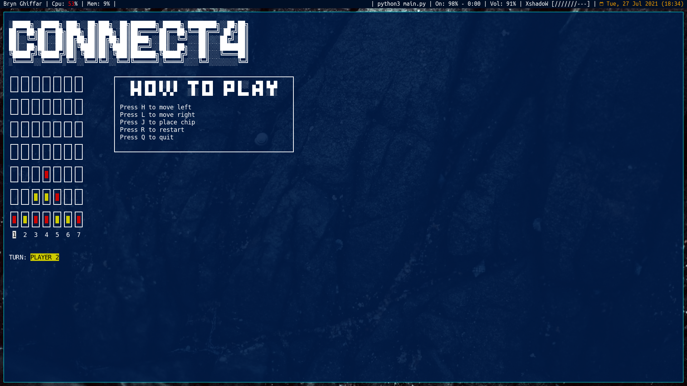

# Connect 4 in the Terminal

**Finally you can play your favourite board game in the terminal...**

**Dependencies:**

* python 3.6.14
* curses python library, installed with `pip3 install curses`

